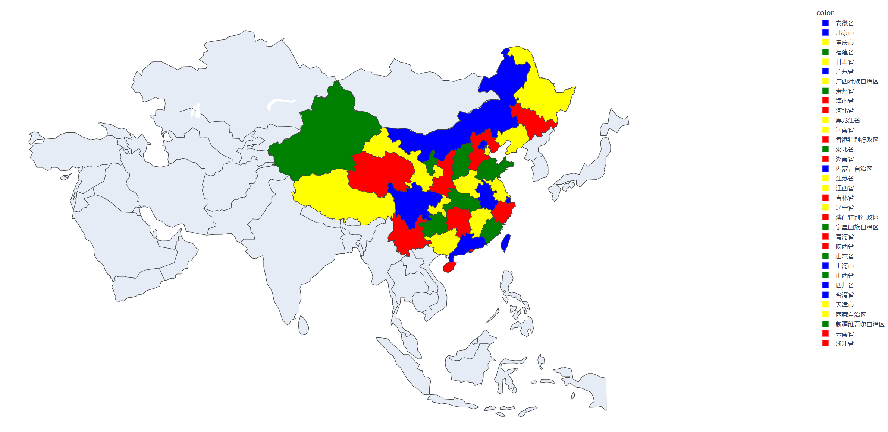

## Graph Coloring Problem

# Author
* yumi-byte
* Zhaohui-mushroom

# My Enviroment
* `Python 3.6.5`

# Independence
```sh
$ pip install plotly
```

# Main File
* `main.py` is a simple realization.
* `main_improve.py` do some improvement that can decrease running time.

# Result
